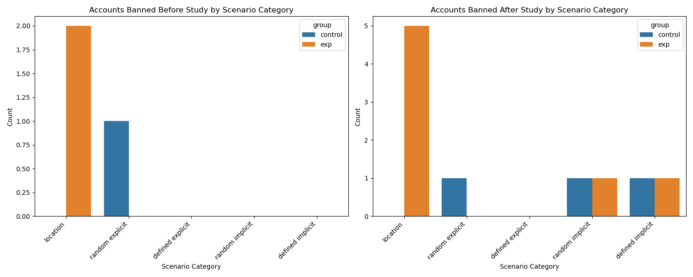

# GDPR Data Analysis

This folder contains GDPR data and its corresponding analysis. The data was requested after the conclusion of the study, and a follow-up evaluation was performed. The results presented here are directly related to the study located in the main project directory.

## Directory Structure

```
📁gdpr_analysis/
├── data_mapping.ipynb -> Main analysis notebook
├── 📁gdpr_data/ -> Raw GDPR data in .zip format
└── 📁plots/ -> Plots and visualizations .png format
```

## GDPR data structure


The GDPR export includes a single JSON file named **user_data_tiktok.json**, which contains various categories of user-related information. The file is structured as a flat object with the following top-level keys:
- Ads and data
- App Settings
- Comment
- Direct Message
- Income Plus Wallet Transactions
- Location Review
- Post
- Profile
- TikTok Shop 
- Tiktok Live 
- Your Activity

## Results

| Scenario ID | Type     | Account name                  | Data retrieved?  | Was banned before? | Banned after study? | Watch history match | LikeList/FollowList |
|-------------|----------|-------------------------------|------------------|---------------------|----------------------|----------------------|----------------------|
| 15-1        | exp      | Robert Metzger (Germany)      | TRUE             | Yes                 | Yes                  | ??                   | Not related          |
| 15-1        | control  | Anthony Diaz                  | TRUE             | No                  | No                   | 99.21%               | Not related          |
| 15-2        | exp      | Charles Mineau (France)       | TRUE             | No                  | Yes                  | 99.37%               | Not related          |
| 15-2        | control  | Kenneth Campos                | TRUE             | No                  | No                   | 98.19%               | Not related          |
| 15-3        | exp      | Sabrina Fallaci (Italy)       | FALSE            | Yes                 | Yes                  | ???                  | Not related          |
| 15-3        | control  | William Zuniga                | FALSE            | N/A                 | N/A                  | ???                  | Not related          |
| 15-4        | exp      | Giorgiana Stoica (Romania)    | TRUE             | No                  | Yes                  | 99.18%               | Not related          |
| 15-4        | control  | David Bryant                  | TRUE             | No                  | No                   | 76.54%               | Not related          |
| 15-5        | exp      | Albert Gunko (UA)             | TRUE             | No                  | Yes                  | 99%                  | Not related          |
| 15-5        | control  | Christopher Hale              | TRUE             | No                  | No                   | 99.45%               | Not related          |
| 16          | exp      | Steven Sherman                | TRUE             | No                  | No                   | 97.78%               | 0                    |
| 16          | control  | Jeremy Perry                  | TRUE             | No                  | No                   | 99.42%               | Not related          |
| 18          | exp      | Matthew Swanson               | TRUE             | No                  | No                   | 99.50%               | 0                    |
| 18          | control  | Jamie Rodriguez               | TRUE             | No                  | No                   | 99.21%               | Not related          |
| 22          | exp      | Jessica Dudley                | TRUE             | No                  | No                   | 68.23%               | 0                    |
| 22          | control  | Stephen Dyer                  | TRUE             | No                  | No                   | 99.21%               | Not related          |
| 23          | exp      | Barbara Martinez              | TRUE             | No                  | No                   | 98.73%               | 0                    |
| 23          | control  | Jeanette Mueller              | TRUE             | No                  | No                   | 98.12%               | Not related          |
| 24          | exp      | Karen Morales                 | TRUE             | No                  | No                   | 99.50%               | 0                    |
| 24          | control  | Denise Morris                 | TRUE             | No                  | No                   | 99.40%               | Not related          |
| 28          | exp      | Cynthia Martinez              | TRUE             | No                  | Yes                  | 99.47%               | 0                    |
| 28          | control  | Brandon Miller                | TRUE             | No                  | No                   | 83.85%               | Not related          |
| 29          | exp      | Tracy Wyatt                   | TRUE             | No                  | No                   | 99.60%               | 1                    |
| 29          | control  | Brittany Parker               | TRUE             | Yes                 | Yes                  | 98.74%               | Not related          |
| 33          | exp      | Samantha Espinoza             | TRUE             | No                  | Yes                  | 97.67%               | Not related          |
| 33          | control  | Nicole Miller                 | TRUE             | No                  | Yes                  | 96.46%               | Not related          |
| 34          | exp      | Rebecca Lester                | TRUE             | No                  | Yes                  | 99.61%               | Not related          |
| 34          | control  | Marissa West                  | TRUE             | No                  | Yes                  | 99.01%               | Not related          |
| 35          | exp      | Heidi Bowen                   | TRUE             | No                  | Yes                  | 88.37%               | Not related          |
| 35          | control  | Nicole Krause                 | TRUE             | Yes                 | Yes                  | 84.93%               | Not related          |
| 37          | exp      | Austin Stewart                | TRUE             | No                  | No                   | 99.53%               | Not related          |
| 37          | control  | Robert Perkins                | TRUE             | No                  | Yes                  | 95.81%               | Not related          |
| 38          | exp      | David Simon                   | TRUE             | No                  | Yes                  | 99.50%               | Not related          |
| 38          | control  | Rick Meadows                  | TRUE             | No                  | Yes                  | 99.41%               | Not related          |
| 39          | exp      | Teresa Adkins                 | TRUE             | Yes                 | Yes                  | 99.60%               | Not related          |
| 39          | control  | Cassandra Petersen            | TRUE             | No                  | Yes                  | 99.41%               | Not related          |
| 40          | exp      | Regina Burtor                 | TRUE             | No                  | No                   | 99.01%               | Not related          |
| 40          | control  | Shelley Cowan                 | TRUE             | Yes                 | Yes                  | 61.09%               | Not related          |
| 41          | exp      | Jesse Rodriguez               | TRUE             | No                  | No                   | 99.47%               | Not related          |
| 41          | control  | Jesus Simon                   | TRUE             | No                  | No                   | 99.23%               | Not related          |
| 42          | exp      | Christy Smith                 | TRUE             | No                  | Yes                  | 99.29%               | Not related          |
| 42          | control  | Melinda Valenzuela            | TRUE             | No                  | Yes                  | 98.94%               | Not related          |
| 9           | exp      | Luis Rodriguez                | TRUE             | No                  | No                   | 98.94%               | Not related          |
| 9           | control  | Michal Nguyen                 | TRUE             | No                  | No                   | 98.25%               | Not related          |

From the results, we can observe that apart from scenario 15-3, which could not be executed during the study, all other accounts were successfully collected and included in the analysis.


### Account Bans

During the experiment, six accounts were banned, three of which belonged to the control group and three to the experimental group. Upon extracting GDPR data approximately two weeks after the end of the study, it was found that an additional 15 accounts had been banned, including six control and nine experimental accounts.

In total, 21 accounts used in the study were eventually banned.

Further analysis was conducted to determine which scenarios were most affected by bans. The majority of banned accounts were associated with scenarios labeled 15-X, which focused on different geographical regions. This pattern is visualized in the figure below. It may suggest that the proxy servers used during those scenarios did not sufficiently anonymize account behavior, potentially leading to higher detection rates by the platform.




### Watch History and User Interactions


Following the ban analysis, we compared watch history data from the GDPR exports with the JSON responses collected during the experiments and used for the analytical part of this work. In most cases, the match rate was very high, with only a few instances showing a match of around 60% to 76%. There were no cases of a 100% match, likely due to the fact that the JSON responses often included videos queued for playback, which the bot did not manage to watch in real-time.

In the next phase, we verified whether user interactions such as likes and follows, performed during the scenarios, were reflected in the GDPR data. It was found that only one account contained a recorded follow interaction, and even then, only toward a single other account.

Based on this finding, several interpretations are possible:

- The accounts may have been subject to shadowbanning during the study, meaning that while actions such as likes or follows appeared to be performed, they were not actually registered by the system or not included in the GDPR export.
- The platform may have retroactively removed records of interactions, particularly if the accounts were later flagged as suspicious. This could have resulted in the deletion of activity logs prior to the GDPR data export.
- TikTok may only log likes and follows performed via the mobile application and ignore interactions executed through the web interface. Since all actions in the experiment were carried out using automated web-based scripts, this could explain their absence from the exported data.
